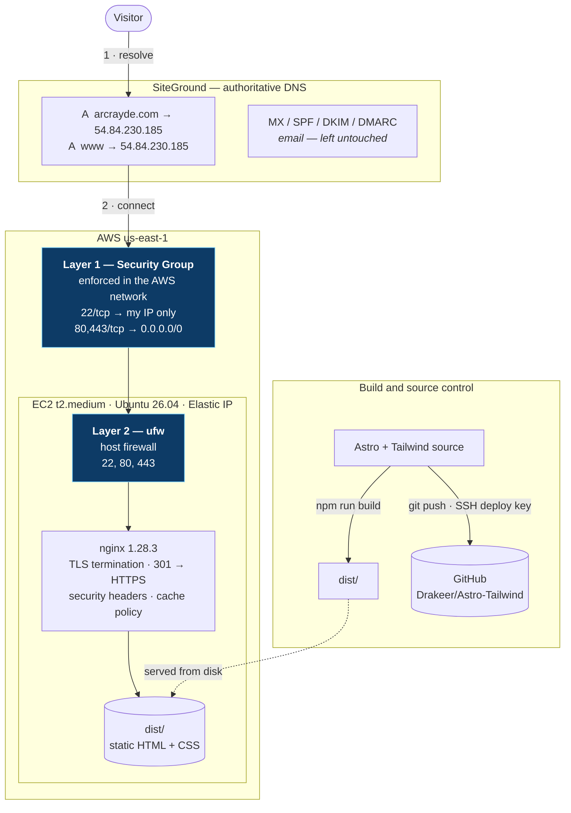

# arcrayde.com

A single-page portfolio site, built and deployed end to end on an AWS EC2 instance.

**Live:** https://arcrayde.com

---

## 1. Purpose

This project exists to learn **developing and deploying with Claude Code**.

The site itself is the artifact; the point was the full path from an empty
directory to a working HTTPS site on my own infrastructure — writing the front
end, wiring the build, provisioning the server, configuring nginx, cutting DNS
over from an existing host, and terminating TLS. It was built collaboratively
with Claude Code as a pair, which is itself part of what I set out to learn:
how to direct an AI agent usefully, where to trust it, and where to verify it.

Written up in the open because the reasoning behind the decisions matters more
than the finished page.

---

## 2. Tech stack, and why

| Layer | Choice | Why |
|---|---|---|
| Site framework | **Astro 5** (`^5.18.2`) | Ships zero JavaScript by default. A portfolio is documents, not an application — a client-side framework would add weight and a build/runtime dependency for nothing. Pinned to 5.x deliberately: `npm create astro@latest` now installs Astro 7. |
| Styling | **Tailwind CSS v4** (`^4.3.3`) | Wired through the `@tailwindcss/vite` plugin. Under v4 that replaces the older `@astrojs/tailwind` integration and `tailwind.config.js`, both deprecated. Design tokens live in a `@theme` block in CSS rather than a JS config. |
| Interactivity | **Plain JS, ~40 lines, inline** | Scroll reveal, clipboard copy, active-nav highlighting. Progressively enhanced — the reveal styles are gated behind a `.js` class so a visitor without JavaScript gets the fully rendered page rather than content stranded at `opacity: 0`. |
| Fonts | **System stacks** | No Google Fonts request. The page makes zero external network calls; the favicon is an inline SVG data URI. |
| Output | **Static HTML/CSS** | `npm run build` emits ~88 KB to `dist/`. No Node process runs in production. |
| Server | **nginx 1.28.3** on **Ubuntu 26.04** | Serves the built files straight from disk. |
| Host | **AWS EC2** `t2.medium`, `us-east-1`, Elastic IP | |
| TLS | **Let's Encrypt** via certbot 4.0.0 | Auto-renewing. |
| DNS | **SiteGround** | Registrar is Network Solutions; DNS and email are hosted separately at SiteGround. |

The deliberate through-line: **keep the production surface as small as
possible**. Static files and one web server. Nothing to patch at runtime, no
application process to crash, no database, no secrets on the box beyond a
TLS key and a repo-scoped deploy key.

---

## 3. Architecture



### Request path

```
https://arcrayde.com
  → SiteGround resolves A record → 54.84.230.185   (TTL 300)
  → AWS Security Group    : is 443/tcp allowed from this source?
  → ufw                   : is 443 allowed on the host?
  → nginx                 : TLS handshake, match server_name
  → dist/index.html       : 200, ~36 KB
```

Every entry point converges on one canonical URL:

| Entry | Hops | Ends at |
|---|---|---|
| `http://arcrayde.com` | 1 | `https://arcrayde.com/` |
| `http://www.arcrayde.com` | 2 | `https://arcrayde.com/` |
| `https://www.arcrayde.com` | 1 | `https://arcrayde.com/` |

A `000-catch-all` server block is the `default_server` and returns **444**
(close the connection, send nothing) for any request whose `Host` header
matches no `server_name` — including requests to the bare IP address, and the
constant background noise of vulnerability scanners. Without it, the first
server block loaded becomes the implicit default, which would let the site be
served under any hostname pointed at this IP.

---

## 4. Repository layout

```
src/
  components/       Hero, About, Skills, Projects, Contact, StatusBar, Footer
  layouts/          Layout.astro — <head>, skip link, the inline JS
  pages/index.astro single page, composes the components
  styles/global.css Tailwind import + @theme design tokens
deploy/nginx/       version-controlled copies of the live /etc/nginx config
COMMANDS.md         every command run on this project, with an explanation
CLAUDE.md           project instructions for Claude Code
```

`deploy/nginx/` is **reference, not live**. Editing it changes nothing until
the files are copied back to `/etc/nginx/` and nginx is reloaded. Keeping the
copies in git means the server's configuration is reviewable and has a history,
rather than existing only as root-owned files on one box.

---

## 5. Operations

```bash
npm run dev                      # local dev server, hot reload
npm run build                    # static output → dist/
npm run preview                  # serve the built output

sudo nginx -t                    # validate config — always before reload
sudo systemctl reload nginx      # graceful, no dropped connections

sudo certbot renew --dry-run     # exercise renewal without touching the live cert
systemctl list-timers certbot.timer
```

TLS renews automatically via the packaged `certbot.timer` (twice daily; acts
only inside the 30-day expiry window). Renewal has been verified with
`--dry-run`, not assumed.

---

## 6. What I learned

### Working with Claude Code

- **Specifications collide, and the collision is the useful signal.** I asked
  for Tailwind v4 in one sentence and v3 in another. Rather than silently
  picking one, the conflict was surfaced with a recommendation and reasoning.
  Reviewing *why* a choice was made turned out to matter more than the choice.
- **An agent will build what you ask for, so unstated context is the risk.**
  I gave no project content, so the Projects section was built from my actual
  skill list as practice areas — with no invented clients, metrics, or repo
  links. Fabricated project claims on a portfolio fail the moment someone asks
  about them in an interview. Knowing which gaps were filled with real
  information and which were left honestly empty is my responsibility, not the
  tool's.
- **Verification beats assertion.** "It builds" is not "it works." Under
  Tailwind v4, a typo in a `@theme` token throws no build error — the utility
  is simply never generated and the page renders unstyled. The fix is to grep
  the compiled CSS for the class, not to trust a green build.
- **A visible change is not necessarily the change you asked for.** I asked to
  cut the hero-to-About gap by 75%. Padding was reduced by exactly that, and I
  saw no difference — because the hero was `min-h-svh` with centered content, so
  the gap was leftover *viewport*, not padding, and `justify-center` absorbed
  half of what was removed. The arithmetic was right and irrelevant. Correct
  diagnosis required understanding the layout, not the numbers.
- **Write things down or they evaporate.** Context does not survive between
  sessions unless it is committed to a file. `COMMANDS.md` and a project memory
  file exist for that reason.

### Git

- **Two roots, no common ancestor.** This repo grew a `master` and a `main`
  with entirely unrelated histories — `git merge-base` returned nothing. That
  can't be merged normally; the files have to be ported deliberately.
- **Choosing which history survives is a judgment call about value, not
  recency.** `main` looked like the stale branch but held the only record of
  how the VPS was provisioned. Deleting it would have destroyed knowledge that
  was not recoverable from the code. The reconciliation kept `main` and moved
  the site onto it.
- **Rewriting history safely.** Commits authored as `drakeer` vs `Drakeer` are
  two different authors to Git. Fixed with
  `git rebase --root --exec 'git commit --amend --author=...'` — `--amend`
  preserves the original author dates, whereas `--reset-author` would have
  destroyed the real timeline.
- **A partial failure can read as success.** `git branch -D master worktree-porfolio-site`
  deleted `master` and errored on the typo'd second name in the same output.
  Skimming it looks like it worked.

### AWS fundamentals

- **Ephemeral vs Elastic IPs.** A stop/start hands the instance a new public
  address. A DNS record pointing at an ephemeral IP breaks on the next reboot.
- **Allocated is not associated.** An Elastic IP that isn't attached to an
  instance does nothing and still bills. Verified by matching the console's
  instance ID against the instance's own metadata service, rather than trusting
  the console alone.
- **Instance metadata (IMDSv2)** is a genuinely useful diagnostic surface —
  instance ID, public IP, region, attached security groups — reachable from the
  box with a token request, no credentials needed.

### Security

- **Two firewalls, not one, and the effective rule is their intersection.** The
  AWS Security Group filters in the network before traffic reaches the
  instance; ufw filters on the host. Neither knows about the other, and neither
  reports the other. A port must be open in **both**. A block in either looks
  identical: a timeout with no error.
- **Layers are not redundancy — they have independent failure modes.** My
  Security Group was briefly wide open (`0.0.0.0/0`, all ports, all protocols)
  while a forgotten dev server sat on port 4321 for 22 hours. With ufw enabled,
  that port would have been closed regardless. One layer failing open is
  exactly the case the other exists for.
- **Order of operations matters.** `ufw allow 22` *before* `ufw enable`.
  Reversed, you lock yourself out of your own box mid-session.
- **Scope credentials to the job.** GitHub access uses a **repo-scoped deploy
  key**, not an account-wide SSH key — the latter would grant push access to
  every repository I own. The auth reply tells you which you have:
  `Hi Drakeer/Astro-Tailwind!` is a deploy key; `Hi Drakeer!` is an account key.
- **Verify host keys.** `ssh-keyscan` blindly appended to `known_hosts` defeats
  the purpose of host verification. The fetched fingerprint was compared against
  GitHub's published value before being trusted.
- **`add_header` in nginx is not cumulative.** Headers from an outer block are
  inherited *only* if the inner block declares no `add_header` of its own. The
  moment a `location` sets its own `Cache-Control`, every server-level security
  header silently disappears for that location. This is the most common way
  security headers end up half-applied. The fix is a snippet re-included in
  every location that sets a header — and then verified per-location with
  `curl -I`.
- **HSTS is a one-way door.** It is meaningless over plain HTTP and dangerous
  before TLS works: a browser that has seen it will refuse to reach the site
  over HTTP for the full `max-age`, and that cannot be revoked from the server.
  Enable it after HTTPS is proven, starting with a short max-age.

### DNS

- **Registrar and DNS host are different roles.** The domain is registered at
  Network Solutions but the authoritative nameservers are SiteGround's. Record
  edits happen where the nameservers are — a distinction that isn't obvious
  until you go looking for the zone editor in the wrong control panel.
- **Moving nameservers moves everything, including mail.** MX, SPF, DKIM and
  DMARC live in the same zone as the A records. Delegating the domain to a
  self-hosted nameserver would silently destroy email delivery unless every one
  of those records is recreated first. This is why the BIND 9 exercise belongs
  on a delegated *subdomain*, not the apex.
- **Lower the TTL before a cutover, not during.** TTL was dropped to 300s a day
  ahead so a bad cutover could be rolled back in five minutes instead of a day.
  Raise it again only after the change is proven — including after TLS works,
  since that is the next thing that can break.
- **Change only what needs changing.** `mail` and `ftp` were A records pointing
  at the *same* old IP as the website. Bulk-updating every record matching the
  old address would have broken email.
- **Propagation is observable, not mystical.** Immediately after the edit,
  `ns1` still served the old address while `ns2` served the new one. Querying
  the authoritative nameservers directly (`dig @ns1... @ns2...`) distinguishes
  "not saved" from "saved, still propagating" — a public resolver cannot.

### Linux, nginx, TLS

- **Unix permissions decide what nginx can serve.** `/home/<user>` is mode
  `750`. `www-data` cannot traverse into it, so a document root under a home
  directory yields 403 rather than a working site.
- **`~` expands to the *login* user's home.** Running
  `ssh user@host 'cat ~/.ssh/id_ed25519.pub'` reads a different file than
  intended when the work happened under another account. Absolute paths remove
  the ambiguity.
- **Clipboards do not cross an SSH boundary.** Copying from a remote terminal
  into a local browser needs `ssh host 'cat file' | pbcopy` — the pipe runs the
  command remotely and lands the output in the *local* clipboard.
- **A hardcoded scheme in a redirect breaks silently when TLS is added.** The
  `www` block used `return 301 http://arcrayde.com$request_uri`. certbot added
  TLS to that block but does not rewrite an existing `return`, so
  `https://www` redirected to plain **http**, then bounced back to HTTPS. It
  worked — which is why it was easy to miss — while sending one request in
  cleartext. Testing only the apex would have shown a clean pass; testing all
  four entry points found it.
- **Cache policy should follow the filename, not the file type.** Astro emits
  build assets with a content hash in the name (`/_astro/index.BRq_hIYa.css`),
  so the URL changes whenever the bytes do — safe to cache for a year as
  `immutable`. Unhashed assets keep their name across deploys and must not be,
  or there is no way to push an update. HTML is `no-cache`, which means "cache
  but always revalidate," so a deploy is visible immediately via a cheap 304.
- **`nginx -t` before every reload.** It parses the whole config without
  applying it, so a typo fails safe instead of taking the site down.

### Debugging

The recurring lesson: **reproduce the exact failing condition before theorizing.**

- A dev server "not working" turned out to be a *different* server on the same
  port, serving a stale scaffold, left running for 22 hours.
- `curl` to `localhost:4321` returned a misleading 200 from an unrelated
  process, because Astro silently falls back to port 4322 when 4321 is taken.
- A bare-IP request returning nothing was the 444 catch-all behaving exactly as
  designed, not an outage.
- `npm run build` failing with `ENOENT: package.json` was the right command in
  a directory checked out to a branch that never contained the site.

In every case the error message was accurate and the assumption was wrong.

---

## 7. Known trade-offs

Honest about what is not ideal:

- **nginx serves `dist/` from inside the git checkout.** A branch switch or a
  failed build changes what production serves, live. Copying `dist/` to
  `/var/www/` on deploy would decouple the two.
- **Deploy is manual** — build on the box, reload nginx. Fine at this size; a
  CI pipeline building on push would remove the drift risk entirely.
- **The Projects section describes practice areas**, not specific shipped work,
  because inventing project detail would be dishonest. It will be replaced with
  real write-ups.
- **CSP allows `'unsafe-inline'` for scripts**, because the page has two inline
  `<script>` blocks. Hash-based CSP is stricter but the hashes change on every
  content edit and would have to be updated server-side after each deploy — a
  silent page-breaker without automation.
- **HSTS is not yet enabled**, pending a short-max-age rollout.

---

## 8. Next

- BIND 9 as an authoritative nameserver, on a delegated `lab.` subdomain so the
  live zone and mail stay untouched
- HSTS, starting at `max-age=300`
- Real project write-ups
